# Real Feedback Application - Design Documentation

## High-Level Design (HLD)

### 1. System Overview

Real Feedback is an anonymous messaging platform that allows users to receive honest feedback from others. Users can create a profile, share their unique link, and receive anonymous messages. The system also integrates AI to suggest messages for senders.

### 2. Architecture

The application follows a monolithic architecture using the Next.js framework, which handles both the frontend (UI) and the backend (API routes).

- **Client**: Browser-based interface built with React and Tailwind CSS.
- **Server**: Next.js Server-Side Rendering (SSR) and API Routes.
- **Database**: MongoDB for storing user data and messages.
- **External Services**:
  - **Google Generative AI**: For generating message suggestions.
  - **Resend** (implied by `emails` dir and dependencies): For sending verification emails.

### 3. Technology Stack

- **Frontend**: Next.js (App Router), React, Tailwind CSS, Shadcn UI.
- **Backend**: Next.js API Routes.
- **Database**: MongoDB, Mongoose (ORM).
- **Authentication**: NextAuth.js.
- **Validation**: Zod.
- **AI**: Google Generative AI SDK.

### 4. Key Components

- **Authentication Module**: Handles Sign Up, Sign In, and Email Verification.
- **Dashboard**: Displays received messages and user controls (e.g., toggle message acceptance).
- **Public Profile**: A public-facing page where anonymous users can send messages.
- **Message Management**: APIs to send, receive, and delete messages.
- **AI Suggestion Engine**: Generates context-aware message suggestions.

### 5. Data Flow Diagram (DFD) - Level 1

### 6. Use Case Diagram

```mermaid
graph LR
    %% Actors
    User["👤 User"]
    Sender["👤 Anonymous Sender"]
    EmailSystem["🖥️ Email Service"]

    %% System Boundary
    subgraph "Real Feedback App"
        direction TB

        %% Authentication Section
        subgraph Auth["Authentication"]
            UC_SignUp("Sign Up")
            UC_Verify("Verify Account")
            UC_SignIn("Sign In")
            UC_Email("Send Verification Email")
        end

        %% User Features
        subgraph UserOps["Registered User Actions"]
            UC_Dashboard("View Dashboard")
            UC_Toggle("Toggle Message Acceptance")
            UC_Delete("Delete Message")
            UC_ViewMsgs("View Received Messages")
        end

        %% Public Features
        subgraph PublicOps["Public/Anonymous Actions"]
            UC_ViewProfile("View Public Profile")
            UC_Suggest("Get AI Suggestions")
            UC_Send("Send Anonymous Message")
        end
    end

    %% Registered User Relations
    User --> UC_SignUp
    User --> UC_Verify
    User --> UC_SignIn
    User --> UC_Dashboard
    User --> UC_ViewMsgs
    User --> UC_Toggle
    User --> UC_Delete

    %% Anonymous Sender Relations
    Sender --> UC_ViewProfile
    Sender --> UC_Suggest
    Sender --> UC_Send

    %% Include
    UC_SignUp -.->|include| UC_Email

    %% Email Service
    UC_Email --> EmailSystem
```

---

## Low-Level Design (LLD)

### 1. Class Diagram

### 2. Sequence Diagrams

#### 2.1 Sign Up Flow

#### 2.2 Send Message Flow

